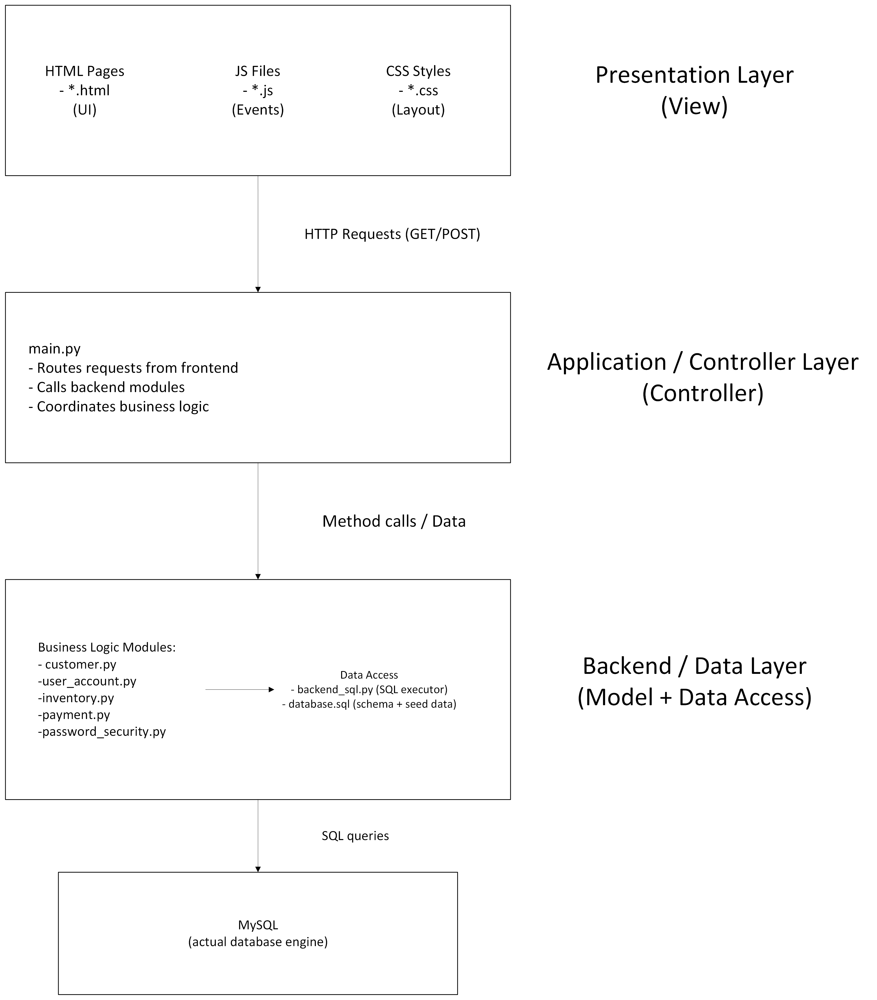

# Github Links for Web-Based POS
README file https://github.com/Sha1704/Web-Based-POS/blob/main/README.md

Source Code Directory https://github.com/Sha1704/Web-Based-POS/tree/main

Test Folder https://github.com/Sha1704/Web-Based-POS/tree/main/tests

# Other Links 

Jira: https://ilstu-team-f6jtugek.atlassian.net/jira/software/projects/SCRUM/summary

Requirements Sheet: https://illinoisstateuniversity-my.sharepoint.com/:x:/g/personal/zestein_ilstu_edu/IQAYZlxsrMeHSYH-WDEKF2CnAWp5NkRPUjlxTNSvXlB03Ok?e=avQcnd

SRS Document: https://illinoisstateuniversity-my.sharepoint.com/:w:/g/personal/zestein_ilstu_edu/IQBoAPvnNY73T4cRMbQ35SUlAU77l6nU3hvTt_vtyLV-NpU?e=LAjtFJ

# How to get Setup
Install VSCode: https://code.visualstudio.com

Required Python Packages:
- Flask
- python-dotenv
- mysql-connector-python
- bcrypt
- boto3
- requests

TO INSTALL dotenv:

Step 1: (Optional but recomended) Create a virtual environment
python -m venv venv_name

Step 2: Activate the virtual environment
On macOS/Linux:
source venv_name/bin/activate

On Windows (PowerShell):
venv_name\Scripts\Activate.ps1

On Windows (Command Prompt):
venv_name\Scripts\activate.bat

Step 3: Install python-dotenv
pip install python-dotenv

Done! If VS Code asks to create or use a virtual environment, choose "Yes".

If you make a virtual environment, install everyting in there and run your code form there

TO INSTALL BCRYPT:

pip install bcrypt

TO INSTALL MYSQL:

pip install mysql-connector-python

TO INSTALL BOTO3 AND REQUESTS (for constantly changing ip)

pip install boto3 requests

TO INSTALL FLASK (for connecting backend code to html)

pip install FLASK

# How to Run

Run this in your terminal:
python application/main.py

Then open your browser and navigate to http://127.0.0.1:5000/

# Web-Based-POS
IT 326 001 Fall 2025’s Web-Based POS system built as a semester-long group project. Features include Loyalty program, earnings report, offline mode and so much more. Designed to support small to medium businesses. 

# Software Architecture Overview
This project uses a combination of Model-View-Controller and N-Tiered layered architecture to organize the system.  It is divided into three main layers, the Presentation Layer (View), the Application/Controller Layer, and the Backend/Data Layer (Model + Data Access).  

# Layer 1: Presentation Layer (Frontend)
Folders: /Frontend/HTML, /Frontend/static

This layer implements the View portion of MVC, it contains:

HTML pages: index.html, login.html, signup.html, bill.html, orderAhead.html

JavaScript files: index.js, login.js, signup.js, bill.js, forgotPassword.js, 

CSS Stylesheets: index.css, account.css, bill.css

The Presentation Layer does not contain business logic.  Its responsibility is to gather input, display output, and forward actions to main.py.

# Layer 2: Application / Controller Layer
Folder: /application

The main.py module acts as the Controller of the MVC design.  It routes incoming requests from the frontend and coordinates all business operations.

# Layer 3: Backend / Data Layer
Folders: /Backend, /data

This layer represents the Model portion of MVC along with the Data Access layer.  It contains both business logic modules and database interaction code.

Business Logic Modules:
customer.py - customer profiles / lookup
user_account.py - account creation, login verification, role checks
inventory.py - item management and stock operations
payment.py - bill calculations and payment logic
password_security.py - hashing, password validation

These modules enforce rules and provide core functionality.

Data Access Components:
backend_sql.py - executes queries, reads/writes to the database
database.sql - contains schema definitnons and intial data

These components abstract actual SQL operations, ensuring business logic modules do not need to directly interact with SQL.
