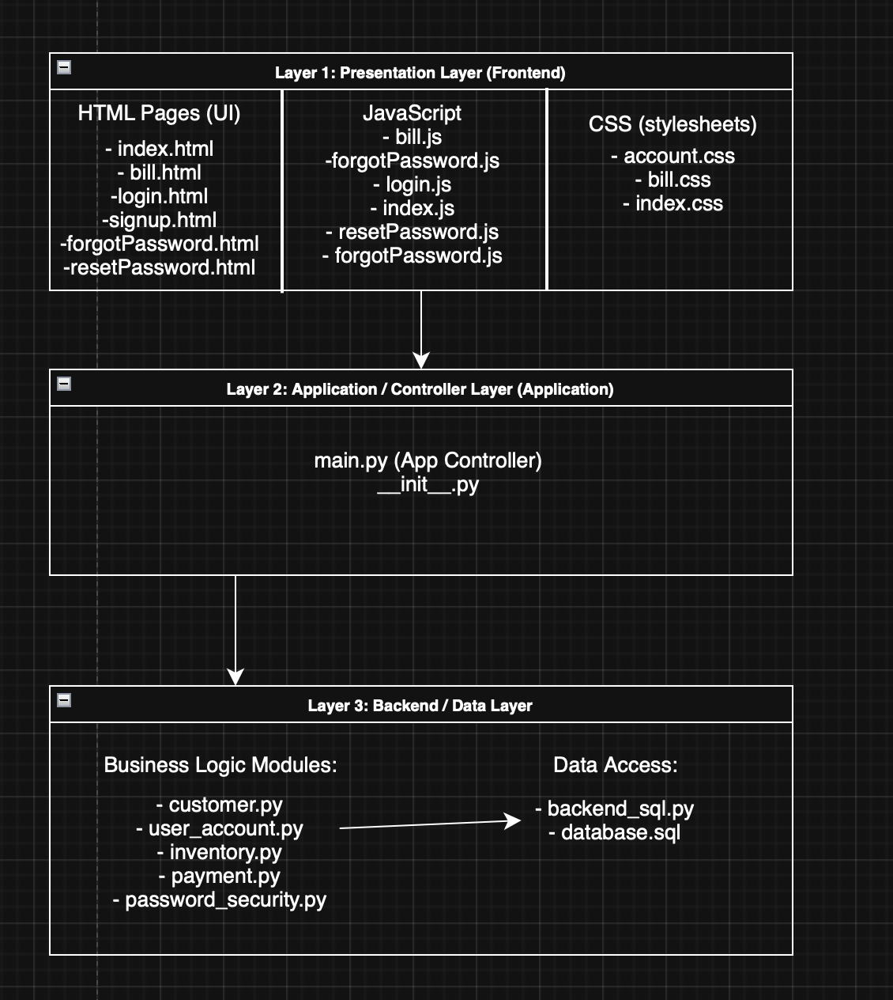

# Web-Based-POS
IT 326 001 Fall 2025’s Web-Based POS system built as a semester-long group project. Features include Loyalty program, earnings report, offline mode and so much more. Designed to support small to medium businesses. 

#Software Architecture Overview
This project uses a combination of Model-View-Controller and N-Tiered layered architecture to organize the system.  It is divided into three main layers, the Presentation Layer (View), the Application/Controller Layer, and the Backend/Data Layer (Model + Data Access).  

#Layer 1: Presentation Layer (Frontend)
Folders: /Frontend/HTML, /Frontend/JS

This layer implements the View portion of MVC, it contains:

HTML pages: index.html, login.html, signup.html, bill.html, forgotPassword.html, resetPassword.html

JavaScript files: index.js, login.js, signup.js, bill.js, forgotPassword.js, resetPassword.js

CSS Stylesheets: index.css, account.css, bill.css

The Presentation Layer does not contain business logic.  Its responsibility is to gather input, display output, and forward actions to main.py.

#Layer 2: Application / Controller Layer
Folder: /application

The main.py module acts as the Controller of the MVC design.  It routes incoming requests from the frontend and coordinates all business operations.

#Layer 3: Backend / Data Layer
Folders: /Backend, /data

This layer represents the Model portion of MVC along with the Data Access layer.  It contains both business logic modules and database interaction code.

Business Logic Modules:
customer.py - customer profiles / lookup
user_account.py - account creation, login verification, role checks
inventory.py - item management and stock operations
payment.pyn - bill calculations and payment logic
password_security.py - hashing, password validation

These modules enforce rules and provide core functionality.

Data Access Components:
backend_sql.py - executes queries, reads/writes to the database
database.sql - contains schema definitnons and intial data

These components abstract actual SQL operations, ensuring business logic modules do not need to directly interact with SQL.

#How the Layers Communicate
Frontend Javascript (Layer 1) sends user actions to main.py (Layer 2).
main.py (Layer 2) processes the request and calls the appropriate Backend module (Layer 3).
Backend business logic (Layer 3) reads/writes data using backend_sql.py and the tables defined in database.sql.
Results are passed back up the layers until they are displayed to the user.
